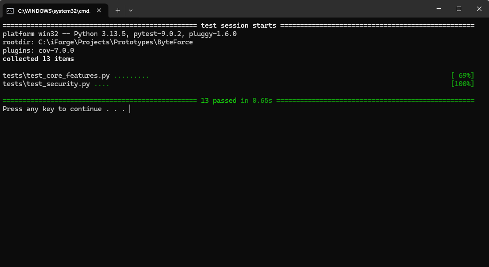
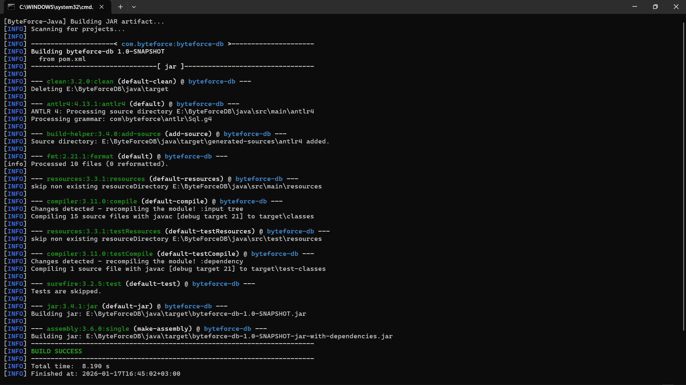
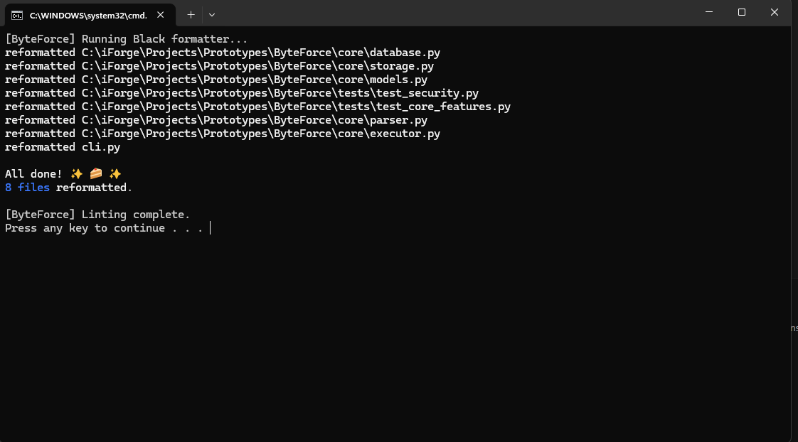

# ByteForceDB 💾

**My logic to creating this:** [How I Crafted](./How_I_Crafted.md)

**ByteForce** isn't just another database—it's a journey into the heart of how data engines actually work. I built this from scratch to peel back the layers of abstraction and demonstrate the core internals of an RDBMS: parsing, query planning, execution, indexing, and persistence.

But I didn't stop at one implementation. I wanted to see how the *same* architectural logic plays out in two completely different programming paradigms.

---

## 🧭 Where do you want to go?

This project is a tale of two languages. Same logic, different worlds.

### 🐍 The Python Edition
**Check the Python Version here:** [➡️ Go to `python/`](./python/)

> "I want to see the logic flowing clearly. I want rapid prototyping and clean, readable code."

*   **Engine:** Pure Python with `Lark` parsing.
*   **Vibe:** Dynamic, flexible, and concise.

### ☕ The Java Edition
**Check the Java Version here:** [➡️ Go to `java/`](./java/)

> "I want to see strict engineering. I want compile-time safety, robust build tools, and high performance."

*   **Engine:** Java 21 with `ANTLR4` and Maven.
*   **Vibe:** Strict, robust, and engineered.

---

## 🏗️ The Shared DNA (Architecture)

Despite their differences, both engines share the exact same heart. Whether it's Python dictionaries or Java Maps, the flow of data remains the classic database architecture:


---

## 🧪 "But does it work?" (Testing & Quality)

I believe a database is only as good as its tests. I didn't just write code; I tortured it to make sure it handles your data correctly.

### 1. The Python Test Suite
I used **`pytest`** to strictly verify the logic. It runs through everything—from simple inserts to complex, multi-table joins.


*See that green? That's the sound of logic working.*

### 2. The Java Build Lifecycle
For Java, I used **Maven** and **JUnit 5**. We don't just run tests; we enforce a strict lifecycle. If the code isn't formatted correctly or if a single type doesn't match, the build fails before it even runs.


*The build process generating parser code and verifying type safety.*

### 3. Code Quality (Linting)
Sloppy code leads to sloppy databases.
*   **Python**: Enforced by **Black**.
*   **Java**: Enforced by **Google Java Format** (via Spotless).



---

## 🚀 Getting Started

Ready to run it? I've made it effortless.

### 🐍 Python Quick Start
1.  Navigate to the `python/` folder.
2.  **Windows**: Double-click `run.bat`. It handles the virtual environment (`venv`) setup automatically!
3.  **Manual**: Run `python cli.py`.

### ☕ Java Quick Start
1.  Navigate to the `java/` folder.
2.  **Windows**: Double-click `run.bat`. It compiles the ANTLR grammar, builds the JAR, and launches the shell.
3.  **Manual**:
    ```bash
    mvn clean install
    java -jar target/byteforce-db-1.0-SNAPSHOT-jar-with-dependencies.jar
    ```

---
*Created by Newton Maina*
