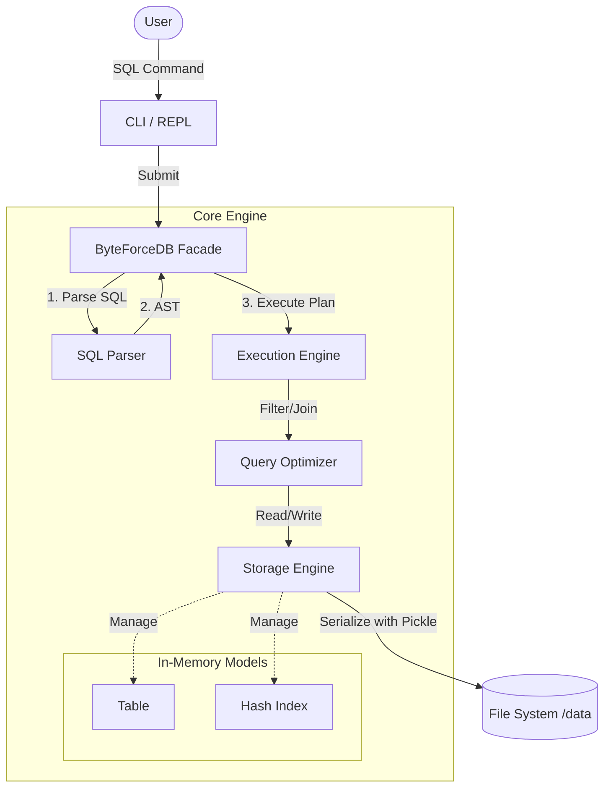

# ByteForce RDBMS

**ByteForce** is a lightweight, pure-Python Relational Database Management System (RDBMS) designed for educational purposes and rapid prototyping. It provides a functional SQL engine that supports parsing, execution planning, indexing, and persistent storage, making it an excellent tool for understanding how databases work under the hood.

## System Architecture

The system follows a classic layered database architecture, separating concerns between parsing, execution, and storage.



## Features

-   **SQL Interface**: Support for standard DDL and DML operations (`CREATE`, `INSERT`, `SELECT`, `UPDATE`, `DELETE`).
-   **Intelligent Parsing**: robust SQL parsing using the **Lark** parsing library.
-   **Performance**:
    -   **Hash Indexing**: O(1) lookups for equality searches.
    -   **Query Optimization**: Automatically utilizes indices for `WHERE` clauses.
-   **Relational Algebra**: Supports `INNER JOIN` operations to combine data across tables.
-   **Data Integrity**: Enforces `PRIMARY KEY`, `UNIQUE`, and `NOT NULL` constraints.
-   **Persistence**: Automatic serialization to disk, ensuring data survives restarts.
-   **Rich REPL**: A beautiful, interactive command-line interface with syntax highlighting, history, and formatted table output.

## Prerequisites

-   **Operating System**: Windows (Batch scripts provided), Linux, or macOS.
-   **Python**: Version **3.9** or higher.

## Quick Start (Automatic Setup)

ByteForce comes with automated scripts to set up your environment instantly.

### 1. Run the Database
Simply double-click **`run.bat`** (or run it from cmd/powershell).

*What this does:*
1.  Checks if a Python virtual environment (`venv`) exists.
2.  If not, it creates one and installs all dependencies from `requirements.txt`.
3.  Launches the ByteForce CLI.

### 2. Run Tests
Double-click **`test.bat`**.

*What this does:*
1.  Ensures the environment is set up.
2.  Runs the comprehensive test suite (`tests/test_core_features.py`) using `pytest`.

## Manual Installation

If you are on a non-Windows system or prefer manual control:

1.  **Clone the repository**:
    ```bash
    git clone https://github.com/yourusername/byteforce.git
    cd byteforce
    ```

2.  **Create and Activate Virtual Environment**:
    ```bash
    # Linux/Mac
    python3 -m venv venv
    source venv/bin/activate
    or
    source ./venv/bin/activate

    # Windows
    python -m venv venv
    .\venv\Scripts\activate
    ```

3.  **Install Dependencies**:
    ```bash
    pip install -r requirements.txt
    ```

4.  **Run**:
    ```bash
    # Set python path to current directory
    export PYTHONPATH=.
    python cli.py
    ```

## Usage Example

```sql
-- 1. Create a table
CREATE TABLE users (id INTEGER PRIMARY KEY, name TEXT)

-- 2. Insert data
INSERT INTO users VALUES (1, 'Alice')
INSERT INTO users VALUES (2, 'Bob')

-- 3. Create a secondary index for speed
CREATE INDEX idx_name ON users(name)

-- 4. Query with filtering (Uses Index!)
SELECT * FROM users WHERE name = 'Alice'

-- 5. Update data
UPDATE users SET name = 'Alicia' WHERE id = 1

-- 6. Complex Join
CREATE TABLE orders (oid INTEGER PRIMARY KEY, user_id INTEGER, amount FLOAT)
INSERT INTO orders VALUES (100, 1, 50.5)
SELECT name, amount FROM users JOIN orders ON id = user_id
```

## Project Structure

-   `core/`: Contains the database engine logic.
    -   `parser.py`: SQL grammar and AST generation.
    -   `executor.py`: Execution logic (Select, Insert, Update, etc.).
    -   `storage.py`: Persistence layer.
    -   `models.py`: Data structures (Table, Column, Index).
-   `cli.py`: The entry point for the interactive REPL.
-   `tests/`: Unit tests ensuring system stability.