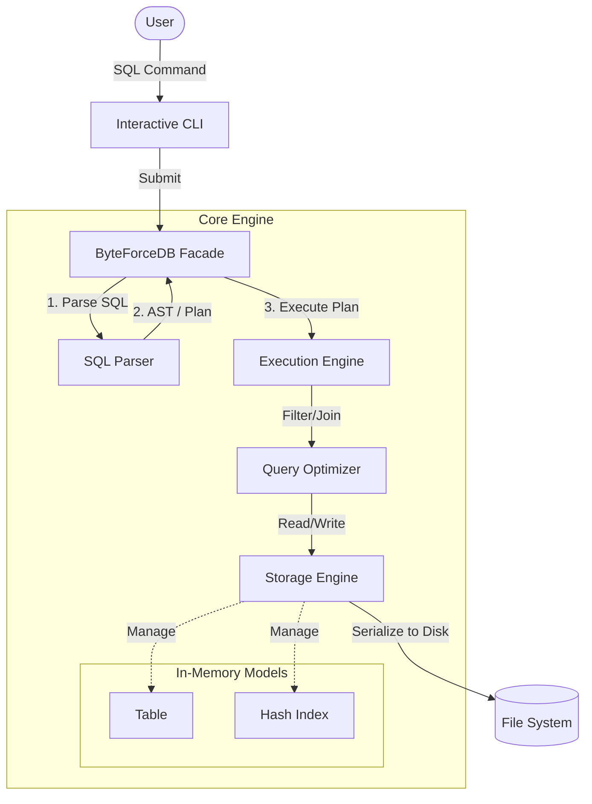
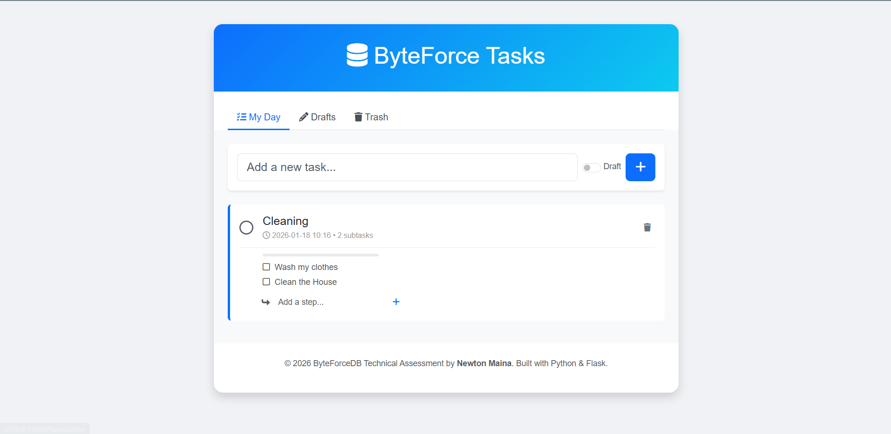
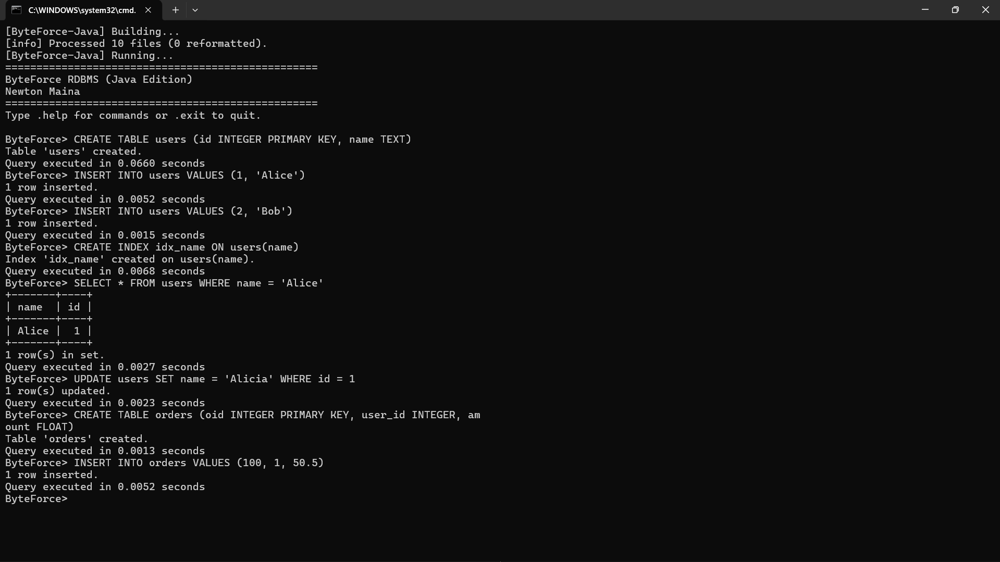
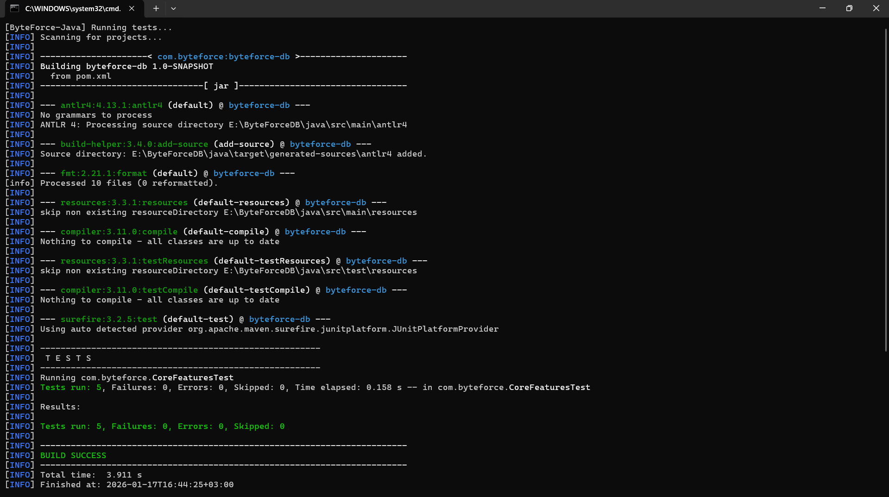
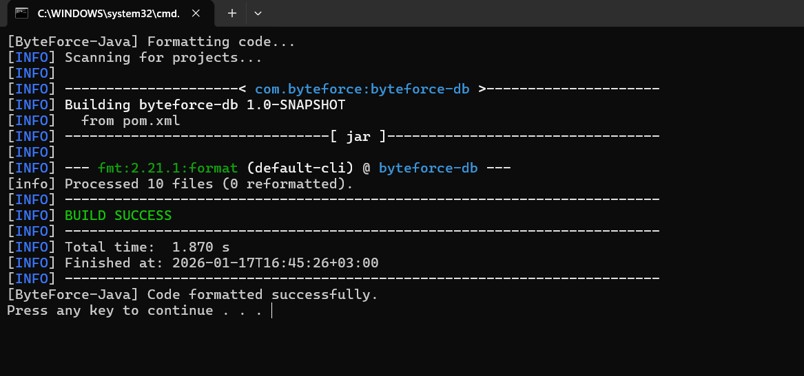

# ByteForceDB

> **Read the Engineering Blog:** [How I Crafted ByteForceDB](./How_I_Crafted.md)

**ByteForce** is a lightweight, Relational Database Management System (RDBMS) built from scratch. It is designed to demonstrate the core internals of a database engine—parsing, query planning, execution, indexing, and persistence—without the complexity of a production-grade system like PostgreSQL.

This project offers a unique **comparative study** by implementing the *exact same architecture* in two different languages: **Python** (Dynamic, Interpreted) and **Java** (Static, Compiled).

---

## Two Worlds, One Logic

| Feature | Python Edition | Java Edition |
| :--- | :--- | :--- |
| **Location** | [**Browse Python Code**](./python/) | [**Browse Java Code**](./java/) |
| **Philosophy** | Rapid prototyping, readability, and flexibility. | Strict type safety, performance, and robustness. |
| **Parsing** | **Lark** (EBNF grammar). | **ANTLR4** (LL(*) parser generator). |
| **Type System** | Dynamic (Duck typing). | Static (Strongly typed models & Records). |
| **Execution** | Dictionary-based processing. | Strictly typed `ExecutionResult` and Maps. |
| **Build Tool** | `pip` & `venv`. | **Maven** (Dependency & Lifecycle management). |
| **Testing** | `pytest` (Concise assertions). | `JUnit 5` (Structured test lifecycle). |

---

## System Architecture

Both implementations follow a classic, layered database architecture:



---

## Key Features (Both Editions)

*   **SQL Subset**: Supports standard `CREATE TABLE`, `INSERT`, `SELECT`, `UPDATE`, `DELETE`.
*   **Joins**: Implements `INNER JOIN` logic to combine data across tables.
*   **Indexing**: Hash-based indexing for O(1) retrieval of records by key.
*   **Persistence**: Auto-saves data to disk (JSON/Pickle/Java Serialization) to persist state between runs.
*   **REPL**: A robust command-line interface with history, auto-completion, and ASCII table formatting.

---

## Python Edition

*Best for understanding the logical flow and rapid experimentation.*

[**Explore the Python Project**](./python/)

### Prerequisites
*   Python 3.9+

### Quick Start
```bash
cd python
./run.bat  # Launch Interactive SQL Shell
# or
./web.bat  # Launch Web Task Manager Demo
```

### Visuals


*Figure 1: The new Web Interface demonstrating complex JOINs and application logic.*


*Figure 2: The logical architecture of the Python implementation.*


*Figure 3: The Pytest suite verifying core features and edge cases.*


*Figure 4: Code quality enforcement using Black.*

---

## Java Edition

*Best for seeing strict engineering practices, type safety, and build tooling.*

[**Explore the Java Project**](./java/)

### Prerequisites
*   Java 21+
*   Maven 3.6+

### Quick Start
```bash
cd java
./run.bat  # Windows (Auto-compile & run)
# or
mvn clean install
java -jar target/byteforce-db-1.0-SNAPSHOT-jar-with-dependencies.jar
```

### Visuals


*Figure 4: The Java CLI running the interactive shell with JLine.*


*Figure 5: Maven build process compiling sources and generating the fat JAR.*


*Figure 6: JUnit 5 test suite execution ensuring system stability.*


*Figure 7: Spotless formatter ensuring Google Java Style compliance.*

---

## Usage Example (Works in Both!)

Once the shell is running, you can execute standard SQL commands:

```sql
-- 1. Create a table
CREATE TABLE users (id INTEGER PRIMARY KEY, name TEXT)

-- 2. Insert data
INSERT INTO users VALUES (1, 'Alice')
INSERT INTO users VALUES (2, 'Bob')

-- 3. Create a secondary index for speed
CREATE INDEX idx_name ON users(name)

-- 4. Query with filtering (Uses Index!)
SELECT * FROM users WHERE name = 'Alice'

-- 5. Update data
UPDATE users SET name = 'Alicia' WHERE id = 1

-- 6. Complex Join
CREATE TABLE orders (oid INTEGER PRIMARY KEY, user_id INTEGER, amount FLOAT)
INSERT INTO orders VALUES (100, 1, 50.5)
SELECT name, amount FROM users JOIN orders ON id = user_id
```

---

## Project Structure

```text
ByteForceDB/
├── python/                 # Python Implementation
│   ├── cli.py              # Entry point
│   ├── core/               # Engine logic
│   └── tests/              # Pytest suite
│
├── java/                   # Java Implementation
│   ├── src/main/antlr4/    # SQL Grammar (Sql.g4)
│   ├── src/main/java/      # Core Engine & CLI
│   └── src/test/java/      # JUnit tests
│
└── How_I_Crafted.md        # Detailed engineering blog/logic
```

---
*Created by Newton Maina*
