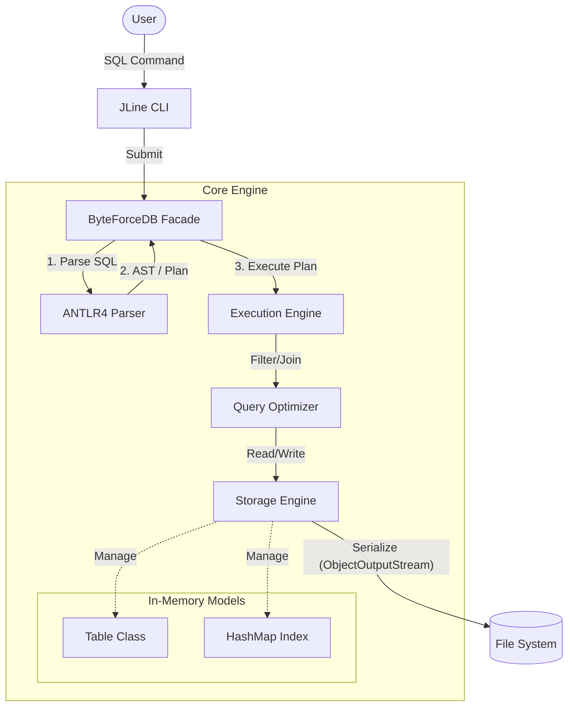

# ByteForceDB - Java Edition

> **Engineering Logic:** [How I Crafted ByteForceDB](../How_I_Crafted.md)

This is the **strict, statically-typed port** of the ByteForce RDBMS. While the Python version focuses on logical clarity, this Java implementation focuses on **engineering rigor, type safety, and build tooling**.

---

## System Architecture

The Java implementation adheres to the same logical architecture as the Python version but leverages Java's type system and ecosystem for robustness.



---

## Key Features

-   **SQL Interface**: Support for standard DDL and DML operations (`CREATE`, `INSERT`, `SELECT`, `UPDATE`, `DELETE`).
-   **Strict Parsing**: Robust SQL parsing using **ANTLR4** (LL(*) parser generator), preventing ambiguity.
-   **Performance**:
    -   **Hash Indexing**: O(1) lookups for equality searches.
    -   **Query Optimization**: Automatically utilizes indices for `WHERE` clauses.
-   **Relational Algebra**: Supports `INNER JOIN` operations to combine data across tables.
-   **Type Safety**:
    -   Uses **Java Records** and **Enums** (`DataType`) to enforce schema validity.
    -   Custom `ExecutionResult` types to prevent runtime casting errors.
-   **Persistence**: Automatic serialization to disk via `ObjectOutputStream`, ensuring data survives restarts.
-   **Rich REPL (Interactive Shell)**:
    -   **Auto-complete**: Context-aware suggestions for SQL keywords (`SELECT`, `FROM`, ...) and meta-commands.
    -   **History**: Persists command history to `~/.byteforce_java_history`.
    -   **Formatting**: Beautiful ASCII tables for query results.

---

## Prerequisites
*   **Java**: JDK 21 or higher.
*   **Maven**: 3.6 or higher.

---

## Quick Start (Two Modes)

ByteForceDB Java Edition now features both a high-performance CLI and a lightweight Web-based Demo.

### 1. Interactive CLI (SQL Shell)
Run the strictly-typed REPL to execute raw SQL commands.
Double-click **`run.bat`** (or `mvn exec:java`).

### 2. Web Interface (Task Manager Demo)
Launch a full-stack Task Manager application built with **Spark Java**.
Double-click **`web.bat`** (or `mvn compile exec:java -Dexec.mainClass="com.byteforce.web.WebApp"`).

*   **Technology Stack**:
    *   **Backend**: Spark Java (Micro-framework).
    *   **Frontend**: Handlebars Templating (`.hbs`).
    *   **Logic**: Direct SQL interaction with the ByteForceDB engine.

#### Web Screenshots (Unified UI)


*Figure 4: The active task list showing hierarchical data (Tasks & Subtasks).*


*Figure 5: The Drafts view for work-in-progress items.*

---

## Manual Installation

If you prefer to run commands manually or are on a non-Windows system:

### 1. Build the Project
This step generates the ANTLR sources, compiles the code, and packages the JAR.
```bash
mvn clean install
```

*Maven build output showing successful compilation and packaging.*

### 2. Run the Database
Launch the interactive shell using the shaded JAR (Fat JAR):
```bash
java -jar target/byteforce-db-1.0-SNAPSHOT-jar-with-dependencies.jar
```

---

## Usage Guide

### Meta Commands
ByteForce CLI supports special commands for managing the database environment:

-   `.tables`: List all tables.
-   `.schema <table>`: Show the structure of a table (columns, types, constraints).
-   `.seed <table> <num>`: Automatically insert `<count>` random rows for performance testing.
-   `.export <table> <f>`: Export a table's data to a CSV file.
-   `.help`: Show available commands.
-   `.exit`: Quit the application.

### SQL Examples
Once the shell is running, you can execute standard SQL commands:

```sql
-- 1. Create a table
CREATE TABLE users (id INTEGER PRIMARY KEY, name TEXT)

-- 2. Insert data
INSERT INTO users VALUES (1, 'Alice')
INSERT INTO users VALUES (2, 'Bob')

-- 3. Create a secondary index for speed
CREATE INDEX idx_name ON users(name)

-- 4. Query with filtering (Uses Index!)
SELECT * FROM users WHERE name = 'Alice'

-- 5. Update data
UPDATE users SET name = 'Alicia' WHERE id = 1

-- 6. Complex Join
CREATE TABLE orders (oid INTEGER PRIMARY KEY, user_id INTEGER, amount FLOAT)
INSERT INTO orders VALUES (100, 1, 50.5)
SELECT name, amount FROM users JOIN orders ON id = user_id
```

---

## Development Workflow

### Code Quality (Linting)
We enforce code style (Google Java Format) automatically using the Spotless/FMT plugin.
```bash
mvn com.spotify.fmt:fmt-maven-plugin:format
# or simply
lint.bat
```

*Spotless plugin ensuring code formatting compliance.*

### Running Tests
We use **JUnit 5** for unit testing core database features.
```bash
mvn test
# or simply
test.bat
```

*JUnit 5 test results verifying database functionality.*

## Embedded API Usage

You can use ByteForceDB directly in your Java applications as an embedded database.

```java
import com.byteforce.core.ByteForceDB;
import com.byteforce.core.ExecutionResult;
import java.util.Arrays;

// 1. Initialize
ByteForceDB db = new ByteForceDB("data");

// 2. Execute DDL
db.execute("CREATE TABLE sensors (id INTEGER PRIMARY KEY, value FLOAT)");

// 3. Insert Data (with parameterized safety)
db.execute("INSERT INTO sensors VALUES (?, ?)", Arrays.asList(1, 23.5));

// 4. Query Data
ExecutionResult result = db.execute("SELECT * FROM sensors WHERE value > 20");
if (!result.isError()) {
    result.getRows().forEach(row -> {
        System.out.println("ID: " + row.get("id") + ", Value: " + row.get("value"));
    });
}
```

---

## Project Structure

```text
java/
├── src/main/antlr4/       # SQL Grammar Definition (Sql.g4)
├── src/main/java/
│   └── com/byteforce/
│       ├── cli/           # Main entry point & JLine REPL logic
│       ├── core/          # Engine Core
│       │   ├── ByteForceDB.java      # Main Facade
│       │   ├── ExecutionEngine.java  # Logic for SELECT, INSERT, etc.
│       │   ├── StorageEngine.java    # Disk persistence
│       │   └── SQLParser.java        # ANTLR Visitor implementation
│       └── core/models/   # Data Structures
│           ├── Table.java            # Table schema & data
│           ├── Column.java           # Column metadata
│           └── DataType.java         # Supported types (INT, TEXT, etc.)
└── src/test/java/         # JUnit Tests
```