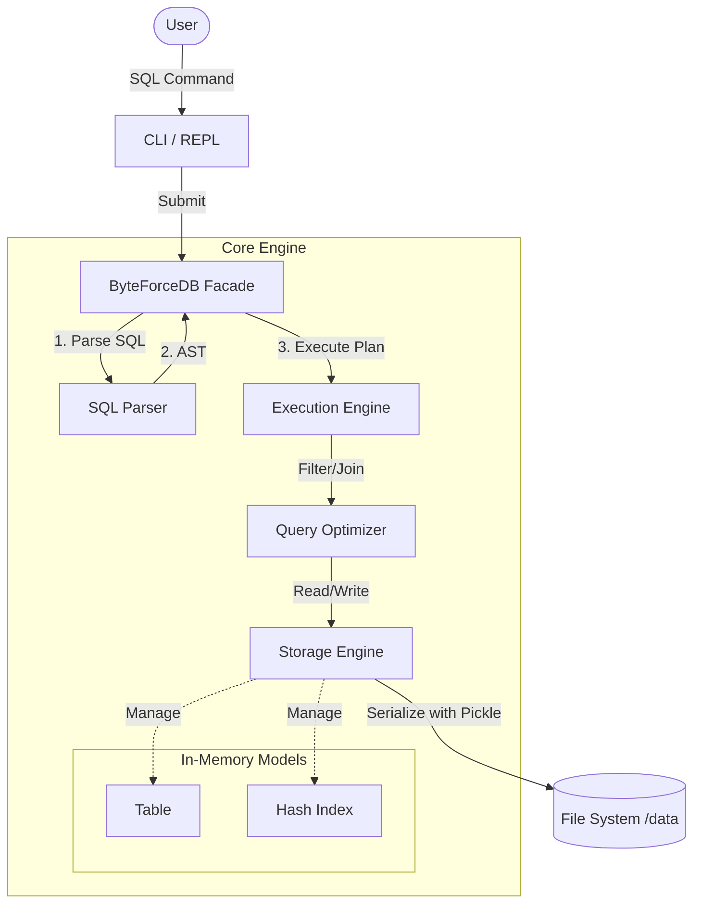
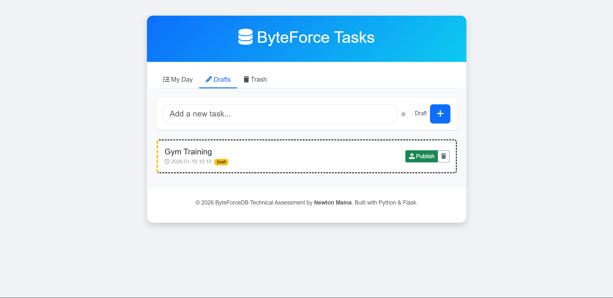
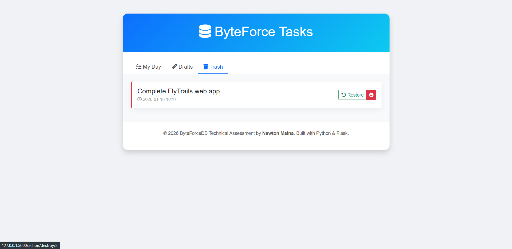

# ByteForceDB - Python Edition

> **Engineering Logic:** [How I Crafted ByteForceDB](../How_I_Crafted.md)


*Figure 1: High-level architectural diagram of the ByteForce engine.*

**ByteForce** is a lightweight, pure-Python Relational Database Management System (RDBMS) designed for rapid prototyping. It provides a functional SQL engine that supports parsing, execution planning, indexing, and persistent storage, making it an excellent tool for understanding how databases work under the hood.

---

## System Architecture

The system follows a classic layered database architecture, separating concerns between parsing, execution, and storage.



---

## Key Features

-   **SQL Interface**: Support for standard DDL and DML operations (`CREATE`, `INSERT`, `SELECT`, `UPDATE`, `DELETE`).
-   **Intelligent Parsing**: robust SQL parsing using the **Lark** parsing library.
-   **Performance**:
    -   **Hash Indexing**: O(1) lookups for equality searches.
    -   **Query Optimization**: Automatically utilizes indices for `WHERE` clauses.
-   **Relational Algebra**: Supports `INNER JOIN` operations to combine data across tables.
-   **Security**: Supports **Parameterized Queries** (`?` placeholders) to prevent SQL Injection attacks.
-   **Data Integrity**: Enforces `PRIMARY KEY`, `UNIQUE`, and `NOT NULL` constraints.
-   **Persistence**: Automatic serialization to disk, ensuring data survives restarts.
-   **Rich REPL**: A beautiful, interactive command-line interface with syntax highlighting, history, and formatted table output.

---

## Prerequisites

-   **Operating System**: Windows (Batch scripts provided), Linux, or macOS.
-   **Python**: Version **3.9** or higher.

---

## Quick Start (Two Modes)

ByteForceDB now features both a classic Command-Line Interface (CLI) and a modern Web-based Demo.

### 1. Interactive CLI (SQL Shell)
Run the classic REPL to execute raw SQL commands.
Double-click **`run.bat`** (or `python cli.py`).

### 2. Web Interface (Task Manager Demo)
Launch a full-stack Task Manager application built on ByteForceDB.
Double-click **`web.bat`** (or `python webapp.py`).

*   **Features**:
    *   **Active Tasks**: View and manage to-do items.
    *   **Drafts**: Save tasks without publishing them immediately.
    *   **Trash**: Soft-delete items with restore capability.
    *   **Subtasks**: Nested task support demonstrating `LEFT JOIN`.

#### Web Screenshots


*Figure 4: The active task list showing hierarchical data (Tasks & Subtasks).*


*Figure 5: The Drafts view for work-in-progress items.*


*Figure 6: The Trash can for recovering deleted items.*

---

## Embedded API Usage

You can use ByteForceDB directly in your Python applications as an embedded database (similar to SQLite).

```python
from core.database import ByteForceDB

# 1. Initialize
db = ByteForceDB(data_dir="data")

# 2. Execute DDL
db.execute("CREATE TABLE sensors (id INTEGER PRIMARY KEY, value FLOAT)")

# 3. Insert Data (with parameterized safety)
db.execute("INSERT INTO sensors VALUES (?, ?)", [1, 23.5])
db.execute("INSERT INTO sensors VALUES (?, ?)", [2, 45.1])

# 4. Query Data
results = db.execute("SELECT * FROM sensors WHERE value > 20")
# Returns: [{'id': 1, 'value': 23.5}, {'id': 2, 'value': 45.1}]

print(results)
```

---

## Manual Installation

If you are on a non-Windows system or prefer manual control:

1.  **Clone the repository**:
    ```bash
    git clone https://github.com/Newton-Maina/ByteForceDB.git
    cd ByteForceDB/python
    ```

2.  **Create and Activate Virtual Environment**:
    ```bash
    # Linux/Mac
    python3 -m venv venv
    source venv/bin/activate
    or
    source ./venv/bin/activate

    # Windows
    python -m venv venv
    .\venv\Scripts\activate
    ```

3.  **Install Dependencies**:
    ```bash
    pip install -r requirements.txt
    ```

4.  **Run**:
    ```bash
    # Set python path to current directory
    export PYTHONPATH=.
    python cli.py
    ```

---

## Development Workflow

### Code Quality
This project enforces **PEP 8** standards using the `Black` formatter. To ensure code quality, run:
```bash
lint.bat
```


*Output of the Black formatter ensuring code style compliance.*

### Running Tests
Double-click `test.bat` (Windows) or execute:
```bash
# Set PYTHONPATH to current directory
export PYTHONPATH=.  # Linux/Mac
set PYTHONPATH=.     # Windows CMD

pytest tests/
```


*Pytest suite results verifying system correctness.*

---

## Usage Example

```sql
-- 1. Create a table
CREATE TABLE users (id INTEGER PRIMARY KEY, name TEXT)

-- 2. Insert data
INSERT INTO users VALUES (1, 'Alice')
INSERT INTO users VALUES (2, 'Bob')

-- 3. Create a secondary index for speed
CREATE INDEX idx_name ON users(name)

-- 4. Query with filtering (Uses Index!)
SELECT * FROM users WHERE name = 'Alice'

-- 5. Update data
UPDATE users SET name = 'Alicia' WHERE id = 1

-- 6. Complex Join
CREATE TABLE orders (oid INTEGER PRIMARY KEY, user_id INTEGER, amount FLOAT)
INSERT INTO orders VALUES (100, 1, 50.5)
SELECT name, amount FROM users JOIN orders ON id = user_id
```

---

## Project Structure

-   `core/`: Contains the database engine logic.
    -   `parser.py`: SQL grammar and AST generation.
    -   `executor.py`: Execution logic (Select, Insert, Update, etc.).
    -   `storage.py`: Persistence layer.
    -   `models.py`: Data structures (Table, Column, Index).
-   `cli.py`: The entry point for the interactive REPL.
-   `tests/`: Unit tests ensuring system stability.